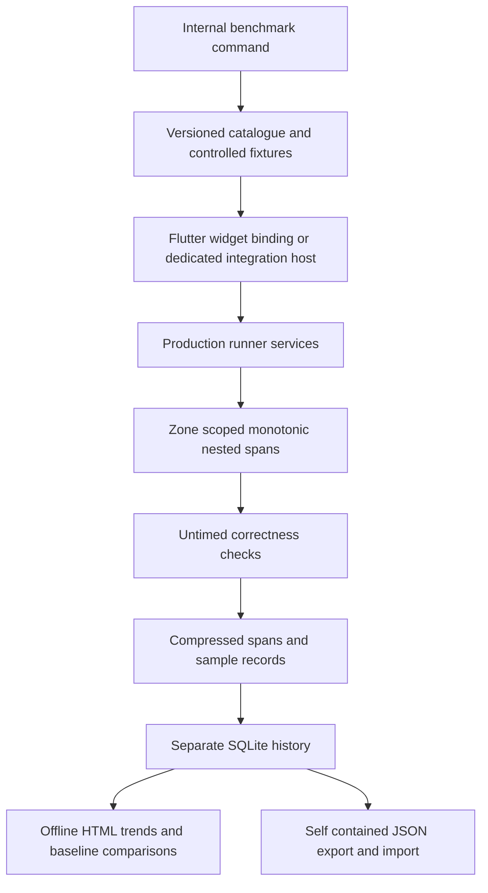

# Runner service benchmarks

Run from `tools/ensemble_test_runner` after `melos bootstrap` at the repository root:

```sh
dart run tool/benchmark_runner.dart --preset=quick
dart run tool/benchmark_runner.dart --preset=full
dart run tool/benchmark_runner.dart --preset=full --service=screenshot,observer
dart run tool/benchmark_runner.dart --case=observer.repeated.100
dart run tool/benchmark_runner.dart --mode=integration --device=<flutter-device-id>
dart run tool/benchmark_runner.dart --compare=<run-id>
dart run tool/benchmark_runner.dart --history
dart run tool/benchmark_runner.dart --import=/path/to/export.json
dart run tool/benchmark_runner.dart --check-coverage
dart run tool/benchmark_runner.dart --list
```

Use the same Dart and Flutter SDK. The command locates Flutter beside the invoking Dart SDK; `--flutter=/path/to/flutter` overrides it. Dependencies must already be available locally: the command resolves the package offline before compiling the benchmark worker. CI comparisons use Flutter **3.47.2**.

## Architecture



`tool/benchmarks/cases.dart` describes workloads; it calls the real session, executor, screenshot, observer, planner, report, artifact, support-service and CLI implementations. Fixed YAML screens and widgets provide the input. Temporary projects belong to the benchmark run. Application business logic, network performance and frame-performance scores are excluded. Synthetic frame entries measure the runner's log processing. Screenshot capture includes the rendering needed to obtain its image.

`lib/src/benchmark_measurement.dart` is internal instrumentation. A collector exists only in the Zone created by the benchmark tool. Widget cases use the same live Flutter test binding as the production entrypoint, with frames restricted to explicit pumps; integration uses its device binding. Ordinary runner invocations create no collectors, clocks, history, artifacts or benchmark configuration. The collector does not pump frames, enable semantics or perform IO; production services retain those responsibilities. Queued commands record waiting separately from execution.

Component workloads prepare, verify and reset outside measurement. Workflow workloads intentionally include their service interactions and lifecycle work. The fixed worker projects use the production CLI's staging, sharding, launch and merge implementation and the production planner/application workflow. Each child writes its own process-scoped spans and resource observations after measurement.

## Catalogue and coverage

Each case records a stable ID, fixture version, service, component/workflow kind, dimensions, quick-preset membership, operations and required capabilities. `coverage.dart` contains explicit YAML step declarations, session capability mappings and coverage anchors for services outside the step registry. `operation_cases.dart` maps every instrumented production operation to an execution case. The command checks the production source inventory before launching Flutter and rejects absent/stale operation mappings, duplicate IDs, absent cases and vocabulary/capability drift. It also reports and fails unexpectedly unmeasured operations assigned to the selected cases. Aliases have independent routing cases and use their canonical executor.

The full preset exercises every available catalogue case, including expected failures. Capability-dependent cases remain in the catalogue with a skip reason. A partial selection is not full environment coverage. Run widget and device integration environments separately. Host subprocess, codec and doctor cases are skipped on devices; worker counts are skipped when host capacity is insufficient.

Workload variations include retained routes beneath modals, identical/changed frames, increasing list/API/log sizes, dependency chains/fanout, reports with growing step/artifact references, new/existing history databases, and duplicate/malformed/checksum-invalid artifact streams. Session dependencies have one predecessor in the current runner; chains and fanout exercise the supported graph shapes.

Two current runner behaviors are explicit fixtures: `expectStyle` rejects style properties, and the session observer does not fulfill `includeScreenshot`. Neither is silently treated as a successful screenshot/style operation. The paired screenshot/diagnostic-observer workflow freezes pixels and collects the observer in the same synchronous turn while holding the leaf queue.

The legacy navigation screenshot callback is bypassed by the current standalone driver's navigation service. A collector-guarded internal bridge lets the navigation pairing fixture execute that existing implementation through a real executor callback, without changing ordinary navigation routing.

When adding a runner feature:

1. Add real operation instrumentation with a stable service/operation name.
2. Add a case with representative input sizes and correctness checks.
3. Update the explicit coverage mapping and fixture version when the workload changes.
4. Run catalogue checks and inspect spans to confirm the intended work actually happened.

## Execution protocol

| Preset | Warmup rounds | Measured samples | Process scope |
| --- | ---: | ---: | --- |
| quick | 3 | 10 | Shared sequential process |
| full | 5 | 30 | Dedicated process per case |
| cold cases | 0 | Preset sample count | Fresh process per sample |

Control cases accompany service/case selections to record collection overhead. Very short component operations repeat until at least 200 ms of measured work is accumulated. Samples record iteration count, total elapsed time and normalized time per iteration. A defensive batch limit invalidates an undersized sample. Compilation/binding bootstrap and fixture preparation are outside component measurements. Samples record preparation, cleanup and verification durations separately. Worker workloads additionally report compilation/bootstrap to their workload-ready marker separately from worker execution.

`--samples=N`, `--warmup=N`, `--min-sample-ms=N` and `--isolation=shared` support implementation smoke checks. Shared full runs deliberately sacrifice process/resource isolation, including cold-process guarantees; they must not be used as performance baselines. Their protocol differs from the default full preset. Incorrect outputs, missing worker results, unclosed spans and preparation/cleanup failures invalidate measurements. Expected error paths are named/dimensioned separately; their internal spans retain error outcomes. Uncaught failures retain elapsed time and raw spans but do not contribute to successful timing summaries.

## Meaning of measurements

- Inclusive elapsed time covers the operation and its descendants.
- Exclusive elapsed time subtracts the **union** of child intervals, clipped to the parent, so overlapping children are not subtracted twice.
- Service inclusive totals count only spans without an ancestor of the same service. Operation paths retain nested breakdowns even after raw traces expire.
- Spans identify case, sample, process, worker, span and parent. Parent IDs are scoped to a process. Start offsets are relative to that process's collector clock; cross-process offsets are not a synchronized global timeline.
- Work counters and dimensions accompany durations. Compare call count and work size before interpreting a speedup. Per-call median/p95 and sample coefficient of variation reveal expensive calls and noisy results.
- Captures record pixels and captured/dropped frames; locator resolution records candidates before collapse/filtering and retained matches; atomic writes record bytes and files. Compact operation summaries retain dimension variants, including execution mode, synchronization policy and actual codec, after detailed spans expire.
- Elapsed time includes waiting and is **not CPU time**. Child process work can overlap; aggregate worker work can exceed suite wall time. The report never converts that sum into a suite-time percentage.
- Raw spans in widget mode are compressed between samples, outside measurement. Exact per-call histograms merge sample summaries without retaining every raw span in the test process.
- CPU is user plus system CPU from `getrusage` on supported 64-bit macOS/Linux hosts; unsupported platforms report null with a reason. RSS before/after and process peak RSS describe the observation interval. Shared-process peak RSS cannot be attributed to an individual case. Full dedicated processes and child workers provide better attribution. Resource intervals include preparation/warmup as labeled; compilation happens in separate processes.
- Sustained screenshot and observer workloads expose repeated-call cost and RSS observations. RSS is an observation, not proof of a leak.
- `control.noop` and `control.instrumented` record harness/collection overhead. Timing summaries retain this overhead; they do not subtract an estimated correction.

## History and artifacts

All benchmark output lives in `.ensemble_benchmarks/` (or `--root=...`), independent of normal runner history:

```text
history.sqlite                 compact runs/cases/samples/operations/baselines
index.html                     self contained history report
runs/<run-id>/manifest.json     revision/environment/protocol/coverage metadata
runs/<run-id>/summary.json      normalized timing/counter/resource summaries
runs/<run-id>/export.json       portable summary plus compact samples
runs/<run-id>/spans.jsonl.gz    detailed process-scoped span records
runs/<run-id>/worker-output/    raw worker output
runs/<run-id>/fixtures/         disposable fixture projects and artifacts
```

SQLite schema versions are managed through database migrations. Version 1 creates the initial schema; an unknown upgrade fails explicitly instead of guessing. Imports validate export versions and IDs, insert transactionally and deduplicate by run ID. They never overwrite existing runs. Portable exports include compact samples; detailed spans are archived alongside the export when needed.

Compact history, summaries and exports remain indefinitely. Detailed spans, raw worker output, logs and fixture artifacts are pruned after 30 days by default. `--prune-details --retention-days=N` performs explicit pruning. No automatic compact-history deletion is implemented.

Default comparisons use the latest compatible run on the same branch. `--compare=<id>` pins a baseline and rejects an incompatible one. Compatibility includes SDK revision, lock hash, OS/host/device, build mode, codec availability, fixture/catalogue hashes, preset, protocol, isolation, worker settings and selection. Case dimensions/fixture versions must also match. First runs say **no baseline**. Comparisons retain absolute/percentage timing changes, calls and counters from both runs. Changing fixtures intentionally starts a new trend.

## CI and verification

`.github/workflows/ensemble-test-runner.yml` runs the benchmark job manually or when `tools/ensemble_test_runner/` changes and pins Flutter 3.47.2. Each run uploads its export, HTML report and detailed data as a workflow artifact retained for 30 days. Same-repository pull requests receive the artifact download link in a comment; fork pull requests cannot be commented on automatically because their workflow token is read-only. The artifact link downloads a ZIP, which contains `.ensemble_benchmarks/index.html`. The workflow does not publish a persistent website or save shared CI history. For long-term trends, import CI `export.json` files into local history; the local SQLite database and generated HTML report remain available until explicitly pruned. Timing regressions are report-only; broken harnesses or invalid samples fail the job.

For local history, runs accumulate in `tools/ensemble_test_runner/.ensemble_benchmarks/history.sqlite`; open its `index.html` to browse trends. Run `dart run tool/benchmark_runner.dart --history` to regenerate the page. To add a CI run locally, download its `export.json` artifact and run `dart run tool/benchmark_runner.dart --import=/path/to/export.json`. Imports are deduplicated by run ID.

Verification commands:

```sh
flutter analyze --no-pub
flutter test test/benchmarks
flutter test
dart run tool/benchmark_runner.dart --preset=full --isolation=shared \
  --samples=1 --warmup=0 --min-sample-ms=0 --root=/tmp/runner-benchmark-smoke
```

The smoke protocol checks execution and output completeness; it is not a performance baseline. Native integration additionally needs a selected device and its platform build toolchain. Run a default quick benchmark to verify warmup/batching and a cold case with two samples to verify distinct processes. The focused tests cover overlap accounting, concurrent contexts, error/timeout closure, inactive behavior, Future identity, catalogue drift, normalized summaries, baseline compatibility, import deduplication and retention.

For iOS integration on Flutter >= 3.44, follow the repository prerequisite to disable SwiftPM (`flutter config --no-enable-swift-package-manager`) before generating the host. The host raises its iOS deployment target to 15.0 for the existing Firebase dependencies. Native integration needs a device-specific verification run; widget verification does not establish native toolchain availability.
