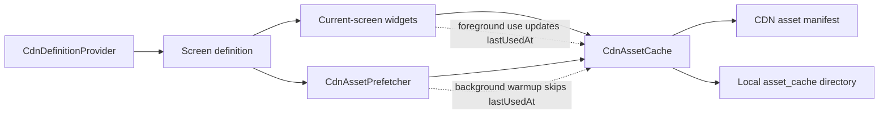
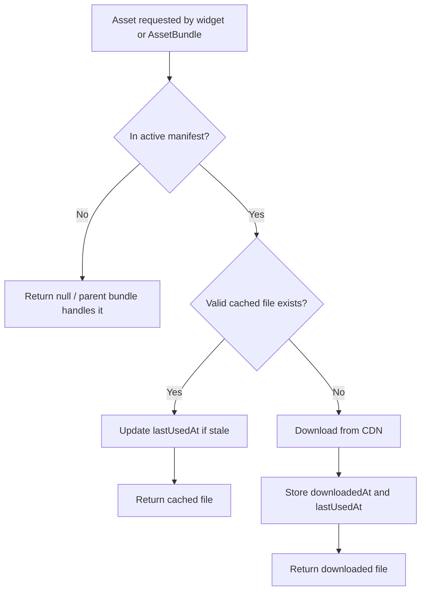
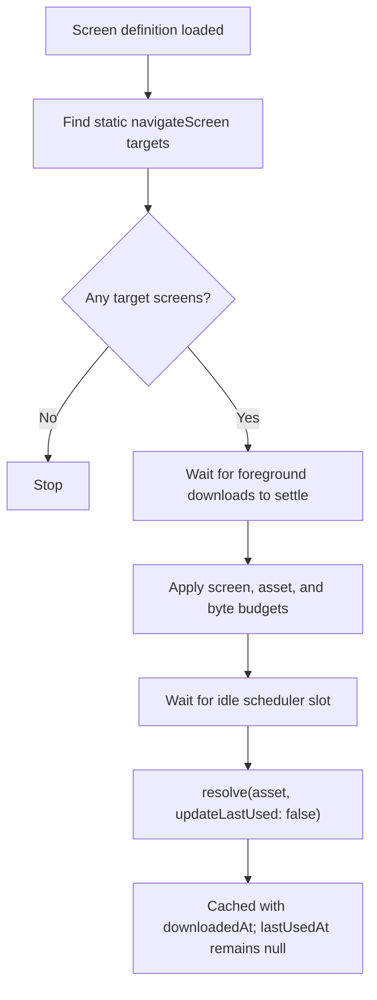
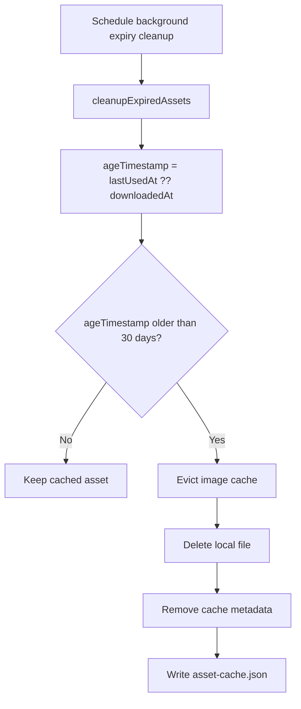

# Asset cache and prefetcher

This document describes the CDN asset cache and next-screen asset prefetcher
implemented under `modules/ensemble/lib/framework`.

## Overview

`CdnAssetCache` owns the local CDN asset manifest, cached files, cache metadata,
and download de-duplication. It resolves app asset sources to local files when
the source is listed in the active CDN asset manifest.

`CdnAssetPrefetcher` is a background helper that warms assets for statically
discoverable next-screen navigation targets. It does not prefetch current-screen
assets because those are handled by normal widget rendering through
`CdnAssetCache`.



## Cache file layout

Cached files are stored under the app support directory:

```text
asset_cache/
  asset-cache.json
  assets/
    <asset file name>
```

`asset-cache.json` contains the CDN asset manifest plus per-asset cache state.
For each cached asset, the state stores:

| Field | Meaning |
| --- | --- |
| `downloadedAt` | When the local file was downloaded. |
| `lastUsedAt` | When the asset was actually used by the app. `null` means the asset is cached but has not been used yet, for example because it was only prefetched. |

Older cache entries that do not have `lastUsedAt` are migrated by treating
`downloadedAt` as the last-used time. This avoids expiring existing user caches
immediately after upgrading.

## Normal asset resolution

Foreground asset use goes through `CdnAssetCache.resolve(source)` or
`getCachedFileIfValid(source)`.

The cache resolves only assets present in the active manifest. A source may be a
managed CDN URL or a manifest file name. If the cached file exists and the cache
state hash still matches the manifest hash, the local file is returned. If not,
the file is downloaded from the CDN asset URL and stored locally.

Normal foreground resolution records usage:

- A foreground download stores both `downloadedAt` and `lastUsedAt`.
- A valid cache hit updates `lastUsedAt`, but writes are throttled to at most
  once per day per asset.
- Reads through `EnsembleAssetBundle` also count as usage because they call back
  into the cache.



## Prefetch behavior

`CdnDefinitionProvider` starts prefetching after a screen definition is loaded.
The prefetcher scans that screen definition for static `navigateScreen` and
`navigateModalScreen` targets, then prefetches assets tagged for those target
screens in the CDN asset manifest.

Prefetching is intentionally limited:

- It only considers literal/static screen names. Dynamic expressions are skipped.
- It prefetches at most five discovered next screens per pass.
- It caps each pass at ten assets and five megabytes.
- It waits for foreground cache downloads to settle before starting or
  continuing background downloads.
- It waits for an idle scheduler slot before each prefetch download.

Prefetch does not mark assets as used. It calls cache APIs with
`updateLastUsed: false`, so a prefetched asset is stored with `lastUsedAt: null`
until the user actually navigates to a screen or widget that reads it.



## Expiry and cleanup

The cache deletes assets unused for 30 days. Expiry is based on:

```text
lastUsedAt ?? downloadedAt
```

This means:

- Assets used by the app expire 30 days after their last real use.
- Assets prefetched but never used expire 30 days after download.
- Assets prefetched and later used switch to expiring from `lastUsedAt`.

Expiry cleanup is scheduled in the background after persisted cache state is
loaded and after a new manifest is saved. Expired assets are deleted from the
local assets directory and removed from `asset-cache.json` without blocking
cache load or manifest save. They are not immediately re-downloaded; they are
fetched again only if requested later.

The cache also removes stale files whose manifest entry is missing or whose hash
no longer matches. Manifest hash refresh downloads do not mark an asset as used,
because they are maintenance work rather than user-visible usage.



## Concurrency

Downloads are de-duplicated by asset name and manifest hash. If multiple callers
request the same asset while a download is already in flight, they share the same
future.

The prefetcher defers to foreground work by checking `hasActiveDownloads` and
waiting for `waitForActiveDownloads()` to complete, followed by a quiet period.
This keeps background prefetching from competing with on-screen asset loading.

## Tests

Relevant tests live in:

- `modules/ensemble/test/cdn_asset_cache_test.dart`
- `modules/ensemble/test/cdn_asset_prefetcher_test.dart`

Run the focused test set from `modules/ensemble`:

```sh
flutter test test/cdn_asset_cache_test.dart test/cdn_asset_prefetcher_test.dart
```
