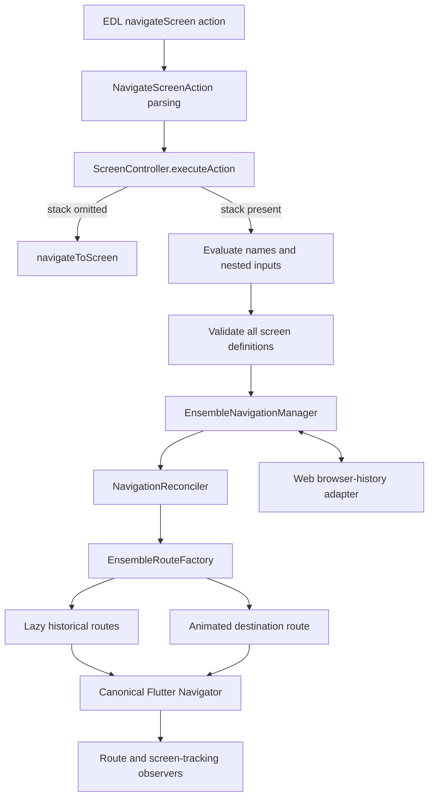

# Ensemble Runtime Navigation Architecture

This document describes how navigation works in the Ensemble runtime.

The runtime uses Flutter Navigator 1.0. Declarative navigation stacks are layered
on top of that imperative Navigator; Ensemble does not use `MaterialApp.router`.

## Scope

This document covers:

- regular, modal, external-screen, and host-navigator navigation;
- declarative `navigateScreen.stack` reconciliation;
- route identity and input matching;
- lazy historical routes;
- transition and screen-tracking behavior;
- action completion and exit reasons;
- Flutter Web Back/Forward integration;
- startup, deep links, and host child mode;
- invariants, extension guidance, diagnostics, and tests.

The implementation is primarily under [`lib/navigation`](../lib/navigation),
with integration in `ScreenController`, `EnsembleApp`, and the route observers.

## Architecture at a glance




## The navigators

Ensemble can interact with two navigator domains. They must not be conflated.


| Navigator                    | Key/access               | Purpose                                                            | Managed declarative history |
| ---------------------------- | ------------------------ | ------------------------------------------------------------------ | --------------------------- |
| Canonical Ensemble navigator | `Utils.globalAppKey`     | Normal Ensemble screens, modals, startup route, declarative stacks | Yes                         |
| Host/external navigator      | `externalAppNavigateKey` | Embedding Ensemble inside another Flutter application              | No                          |


`asExternal: true` selects the host navigator. It is rejected when `stack` is
present because the declarative history manager only owns the canonical Ensemble
navigator.

The `external: true` action property is different: it selects a screen registered
in `Ensemble().externalScreenWidgets`. That screen may still be pushed on the
canonical navigator. Historical `stack` entries themselves represent
Ensemble-defined screens and do not expose an external flag.

## Route metadata

Every managed Ensemble route uses two compatible forms of metadata:

- `EnsembleRouteDescriptor` is the typed internal representation.
- `ScreenPayload` remains in `RouteSettings.arguments` for existing consumers.
- `EnsembleRouteSettings` holds both forms.

An `EnsembleRouteDescriptor` contains:

- screen ID and/or screen name;
- evaluated inputs;
- the external-screen flag;
- the route page type (`regular` or `modal`);
- a unique route ID.

The descriptor is used for reconciliation and browser snapshots. Widgets continue
to receive a `ScreenPayload` so older route observers and screen code do not need
to understand the navigation subsystem.

### Initial route

When `EnsembleApp` owns the screen (`widget.child == null`), it creates the root
through `onGenerateInitialRoutes` with `EnsembleRouteSettings`. This lets the
manager observe Home as the first canonical route.

`home` is intentionally null in this mode. A non-null `onGenerateRoute` callback
must still be supplied because Flutter's `WidgetsApp` constructor assertion does
not count `onGenerateInitialRoutes` as a route provider. The callback is present
to satisfy that Flutter invariant; the typed initial route remains authoritative.

When a host supplies `widget.child`, `EnsembleApp` uses the normal `home` path.
That route is not given Ensemble metadata and is therefore not treated as
declarative Ensemble history.

## Action types and routing paths


### Regular `navigateScreen` without `stack`

This remains the legacy imperative path:

1. `NavigateScreenAction` is parsed.
2. `ScreenController.executeAction` evaluates destination inputs.
3. Toasts, dialogs, and bottom sheets are dismissed according to options.
4. `ScreenController.navigateToScreen` constructs the screen and route.
5. Navigator performs push, replacement, or clear-all.
6. The returned `Navigator.push` future completes when the route is popped.

The supported imperative options are:

- normal push;
- `options.replaceCurrentScreen`;
- `options.clearAllScreens`;
- `asExternal` host navigation;
- `external` registered-screen navigation.


### `navigateModalScreen`

Modal navigation continues through `navigateToScreen` with `PageType.modal`.
The declarative `stack` API is only parsed for `NavigateScreenAction`; modal
actions are not reconciled declaratively. Modal routes still carry typed metadata
when they are pushed on the canonical navigator.

### Declarative `navigateScreen.stack`

Only the extensible object form is accepted:

```yaml
navigateScreen:
  name: ScreenC
  inputs:
    recordId: ${record.id}
  stack:
    - name: Home
    - name: ScreenB
      inputs:
        source: example
```

String-only entries are rejected. `stack` omitted and `stack: []` have different
meanings:

- omitted: use existing imperative navigation unchanged;
- empty array: remove all preceding Ensemble history and make the destination
the new root.

`stack` cannot be combined with `clearAllScreens`, `replaceCurrentScreen`, or
`asExternal`.

## Evaluation and validation

Declarative stack processing occurs before Navigator is mutated.

1. The destination name and every stack-entry name are evaluated against the
  initiating `DataContext`.
2. Names must evaluate to non-empty strings.
3. Nested maps and lists in `inputs` are recursively evaluated against the same
  context.
4. All historical definitions and the destination definition are validated.
5. Independent definition lookups run concurrently to avoid one cache/network
  round trip per historical entry.
6. Errors are inspected in declaration order so diagnostics remain deterministic.

Example diagnostic:

```text
navigateScreen.stack[1] references unknown screen "MissingScreen".
```

Validation is all-or-nothing. No route is pushed or removed if any requested
screen is invalid.

## Route matching and reconciliation

`NavigationReconciler` is pure: it compares the current managed history with the
requested history and returns four values:

- `prefixLength`;
- retained existing routes;
- obsolete existing suffix;
- missing requested suffix.

Only the longest compatible prefix is retained. The reconciler never searches
later in the stack, reorders routes, or deduplicates repeated screens.
Requested screen names are matched against canonical screen names, while
requested IDs are matched against IDs. Route page type and the external-screen
flag must also match, so a modal cannot be retained as a regular stack entry.

### Input matching is directional

Inputs in the requested stack control whether an existing route can be reused:


| Requested entry               | Existing same screen       | Result                             |
| ----------------------------- | -------------------------- | ---------------------------------- |
| Inputs omitted                | Any existing inputs        | Keep existing route and its inputs |
| `inputs: {}`                  | Any existing inputs        | Keep existing route and its inputs |
| Non-empty inputs equal deeply | Same evaluated values      | Keep existing route                |
| Non-empty inputs differ       | Different evaluated values | Drop from mismatch onward          |


This is intentionally different from exact descriptor equality.
`satisfiesHistoryRequest` implements the directional wildcard rule used by the
reconciler. `isEquivalentTo` remains exact and is used for browser snapshots and
restoration comparisons.

When an input-less request retains a route, browser history uses the retained
route's real descriptor. It must not replace the preserved inputs with the
input-less requested descriptor.

### Example

```text
Current:   Home(inputs: user=42) -> ScreenA
Requested: Home                   -> ScreenB -> ScreenC
```

The result is:

```text
KEEP:   Home(inputs: user=42)
DROP:   ScreenA
INSERT: ScreenB
PUSH:   ScreenC
```


## Lazy historical routes

A requested historical route does not imply that its screen should be visited.
Missing history is represented by `LazyEnsemblePageRouteBuilder`.

The lazy route is a real Flutter route, which preserves native Navigator Back
semantics, but its child is dormant until the route becomes visible. Insertion
does not:

- construct the Ensemble `Screen`;
- fetch/build its screen widget through the screen factory;
- create screen scope and page lifecycle state;
- run screen APIs or `onLoad` work;
- publish a screen-tracking event.

Only the destination is constructed eagerly during forward navigation.

```text
Flutter route stack after reconciliation

Materialized(Home)
Lazy(ScreenB)
Materialized(ScreenC)
```


### Materialization on Back

When the destination is popped, Flutter calls `didPopNext` on the lazy route.
The route activates its screen builder while the outgoing destination is still
covering it. This gives the historical screen time to initialize during the
reverse transition. Screen tracking waits for the outgoing transition route's
`completed` future before publishing the materialized screen as visible.

For iOS interactive Back gestures, the manager's observer materializes the
previous lazy route in `didStartUserGesture`, because it can become partially
visible before `didPopNext` is delivered.

Once materialized, a lazy route stays materialized. It behaves like a normal
retained route for the remainder of its lifetime.

## Transaction ordering

`EnsembleNavigationManager` serializes declarative transactions FIFO. Identical
requests already pending are coalesced so rapid repeated taps do not create
duplicate routes. Coalescing uses deep structural equality, so map insertion
order does not make otherwise equivalent inputs different.

The transaction has two completion concepts:

1. **Destination accepted:** the route returned to `ScreenController` as soon as
  Navigator accepts the push.
2. **Internal completion:** transition cleanup and browser synchronization finish;
  the next queued declarative transaction may then start.

The mutation sequence is:

1. Snapshot current canonical history.
2. Calculate the longest compatible prefix.
3. Construct dormant routes for the missing history.
4. Construct the animated destination route.
5. Push all missing lazy routes synchronously.
6. Push the destination synchronously.
7. If a synchronous push fails, remove the newly pushed routes in reverse order.
8. Keep the obsolete current suffix alive through the destination's forward
  transition.
9. Remove the obsolete suffix after the transition completes.
10. Finish browser-history reconciliation before starting the next queued
  declarative transaction.

The old visible route is deliberately removed after the destination transition.
Removing it immediately would leave a dormant transparent route underneath the
destination and could expose the Navigator background as a black frame.
If another navigation removes the destination mid-transition, its `popped`
future releases the transaction queue even though Flutter disposes the animation
without sending a final status notification.

Lazy routes also return false from `canTransitionFrom` and `canTransitionTo`.
This prevents their zero-duration animations from driving an adjacent real
route's `secondaryAnimation` and producing an unexpected transition or flash.

## Observer topology and canonical history

`EnsembleRouteObserver.initializeRouteObservers` registers observers in this
order:

1. `AppRouteObserver` tracks the top-most route for overlay dismissal.
2. Flutter `RouteObserver<PageRoute>` supports `RouteAware` widgets.
3. `ScreenTrackingNavigatorObserver` publishes visible screens.
4. `EnsembleNavigationManager.observer` maintains canonical route history.

The manager observer handles `didPush`, `didPop`, `didRemove`, and `didReplace`.
Only routes with `EnsembleRouteSettings` enter canonical Ensemble history.
Host child-mode routes and routes owned by the external host navigator are
ignored.

During a multi-route declarative push, per-route browser publication is
suppressed. The manager publishes the final logical state as one transaction.

## Screen tracking

Screen tracking represents visibility, not structural Navigator membership.

Normal routes are tracked by `ScreenTrackingNavigatorObserver.didPush`. The
`Screen` widget avoids duplicate tracking when the observer has already published
the same screen.

Lazy historical routes are special:

- their structural `didPush` is ignored by screen tracking;
- reconciliation removal silently purges stale routes from tracking history;
- popping onto a lazy route removes the outgoing tracked route without restoring
a stale screen;
- the materialized `Screen` publishes itself when it is actually revealed.

For a forward rewrite, the expected log is therefore:

```text
INSERT: ScreenB
PUSH: ScreenC
SCREEN TRACKER: ScreenC
```

After Back:

```text
SCREEN TRACKER: ScreenB
```

Do not make screen tracking respond to every lazy route push. That corrupts
analytics by reporting screens the user has never seen.

## Exit reasons and callbacks

`EnsembleRouteExitReason` distinguishes:

- `back`;
- `replaced`;
- `historyReconciled`;
- `rootCleared`.

The manager records a programmatic exit reason before removing or replacing a
route. A real `didPop` defaults to `back`.

`onNavigateBack` is attached to the destination route's `popped` future, but it
runs only when the recorded reason is `back`. Reconciliation, replacement, and
clear-all still dispose route widgets normally without invoking the callback.
The real Back payload is passed through unchanged.

Legacy `navigateScreen` waits for its pushed route to pop before the action
completes. The declarative path preserves that action timing by awaiting
`route.popped` in `ScreenController`, separately from the manager's internal
transaction completion.

## Imperative replacement and clear-all

Stack-less replacement and clear-all remain on the legacy path:

- `Navigator.pushReplacement` is marked `replaced` before mutation.
- `Navigator.pushAndRemoveUntil` is marked `rootCleared` before mutation.

The manager observer then updates canonical history from the resulting Navigator
events. The exit reason prevents these operations from being mistaken for Back.

## Flutter Web browser history

The browser adapter is conditionally imported:

- native platforms use a no-op implementation;
- Flutter Web uses the session-only `dart:html` adapter.

The visible URL is never changed to a public screen URL. Browser state stores only
an opaque token such as `ensemble_history_3`. The descriptor snapshot, including
inputs, remains in an in-memory map keyed by that token.

### Normal navigation

- The first managed route replaces the current browser entry.
- A normal route push adds a browser entry containing the new snapshot token.
- A normal Flutter pop calls browser `back()` unless it originated from
`popstate`.


### Declarative reconciliation

The adapter moves browser history back to the retained prefix, then pushes tokens
for reconstructed history and the destination. If no prefix is retained, it
reuses the earliest reachable entry as the new root. Calling `pushState` after
moving backward truncates the obsolete forward branch.

### Back and Forward

A known token received through `popstate` is resolved to its in-memory snapshot.
The manager then either:

- pops Navigator routes when the snapshot is a strict current prefix; or
- runs the normal reconciler in browser-restore mode for Forward or a changed
branch.

Browser-restore mode suppresses duplicate browser entries.

After refresh, in-memory snapshots no longer exist. Unknown or stale tokens are
ignored and normal application startup wins. Public URL serialization and
refresh restoration are intentionally out of scope.

## Deep links

Platform and app-link handling lives in `deep_link_manager.dart` and
`ios_deep_link_manager.dart`.

Current deep-link handlers call the imperative `ScreenController.navigateToScreen`
path directly after resolving either a global handler result or legacy query
parameters. They do not invoke declarative stack reconciliation. Any future work
that allows deep links to provide `stack` must route through the same evaluation,
validation, and manager pipeline as `ScreenController.executeAction`; passing a
parsed `NavigateScreenAction` to the imperative helper is insufficient.

## PageGroup and retained state

PageGroup, bottom navigation, and other `RouteAware` widgets use the existing
`RouteObserver<PageRoute>`. Declarative reconciliation does not recreate retained
routes, so their widget tree, scroll position, PageGroup index, and local state
survive.

Missing lazy routes have no state to preserve until materialized. Once built,
they follow normal route and PageGroup lifecycle behavior.

## Diagnostics

Debug builds log one summary per declarative transaction:

```text
[Navigation] Transaction: nav_0
Current: Home -> ScreenA
Requested: Home -> ScreenB -> ScreenC
KEEP: Home
DROP: ScreenA
INSERT: ScreenB
PUSH: ScreenC
```

Diagnostics include route names and operations but must not include raw inputs,
which may contain secrets or personal data.

Interpretation:

- `KEEP` means the exact live Flutter route and widget state are retained.
- `DROP` means removal after the destination's forward transition.
- `INSERT` means a dormant Flutter history route, not a visited screen.
- `PUSH` is the only eagerly constructed destination.


## Failure and race behavior

- Validation failure: no Navigator mutation occurs.
- Synchronous push failure: newly pushed routes are removed in reverse order;
the old suffix has not yet been removed.
- Rapid distinct requests: processed FIFO.
- Rapid identical requests: share the pending destination future.
- Missing browser `popstate` during an internal history move: a short timeout
prevents the transaction queue from hanging indefinitely.
- Unmounted browser-restore navigator: restoration is ignored.
- Unknown browser token: normal current/startup state is retained.


## Rules for modifying navigation

Preserve these invariants:

1. Do not mutate Navigator until every requested descriptor validates.
2. Do not treat omitted `stack` as `stack: []`.
3. Do not change exact equality to implement requested-input wildcards; use the
  directional reconciliation matcher.
4. Never reuse a route after the first prefix mismatch.
5. Do not eagerly build historical screens.
6. Do not let lazy routes participate in adjacent transition animations.
7. Keep the outgoing route visible until the destination transition completes.
8. Do not publish lazy route insertion as a screen view.
9. Record programmatic exit reasons before Navigator mutation.
10. Invoke `onNavigateBack` only for a real Back pop.
11. Keep route inputs out of URLs and serialized browser state.
12. Do not add host-child or host-navigator routes to canonical Ensemble history.
13. Preserve `ScreenPayload` in route arguments for compatibility.
14. Keep the root route typed, and retain the non-null `onGenerateRoute` callback
  required by Flutter when `home` is null.


## Key source files


| Area                                      | File                                                                           |
| ----------------------------------------- | ------------------------------------------------------------------------------ |
| Action parsing                            | `modules/ensemble/lib/framework/action.dart`                                   |
| Action execution and legacy navigation    | `modules/ensemble/lib/screen_controller.dart`                                  |
| App/root Navigator setup                  | `modules/ensemble/lib/ensemble_app.dart`                                       |
| Observer registration                     | `modules/ensemble/lib/framework/route_observer.dart`                           |
| Screen visibility tracking                | `modules/ensemble/lib/framework/screen_tracker.dart`                           |
| Transition route implementations          | `modules/ensemble/lib/layout/ensemble_page_route.dart`                         |
| Route models and exit reasons             | `modules/ensemble/lib/navigation/navigation_models.dart`                       |
| Pure prefix calculation                   | `modules/ensemble/lib/navigation/navigation_reconciler.dart`                   |
| Route construction                        | `modules/ensemble/lib/navigation/ensemble_route_factory.dart`                  |
| Transaction and canonical history manager | `modules/ensemble/lib/navigation/ensemble_navigation_manager.dart`             |
| Browser abstraction and adapters          | `modules/ensemble/lib/navigation/browser/`                                     |
| Public schema                             | `modules/ensemble/assets/schema/ensemble_schema.json`                          |
| Native/app deep links                     | `modules/ensemble/lib/deep_link_manager.dart` and `ios_deep_link_manager.dart` |


## Tests and verification

Focused coverage lives in:

- `modules/ensemble/test/action_test.dart`;
- `modules/ensemble/test/navigation_reconciler_test.dart`;
- `modules/ensemble/test/ensemble_navigation_manager_test.dart`.

The tests cover parsing, option conflicts, prefix matching, wildcard inputs,
state retention, lazy materialization, transition isolation, tracking, exit
reasons, transaction coalescing, and browser snapshot publication.

Run focused tests from `modules/ensemble`:

```bash
flutter test \
  test/action_test.dart \
  test/navigation_reconciler_test.dart \
  test/ensemble_navigation_manager_test.dart
```

Then run the broader module checks:

```bash
flutter test
flutter analyze
```

The module currently has documented pre-existing analyzer warnings. Compare
results against the baseline and treat new errors or warnings in navigation files
as regressions.
