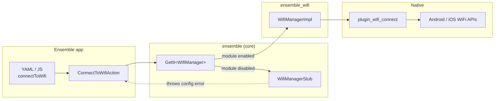
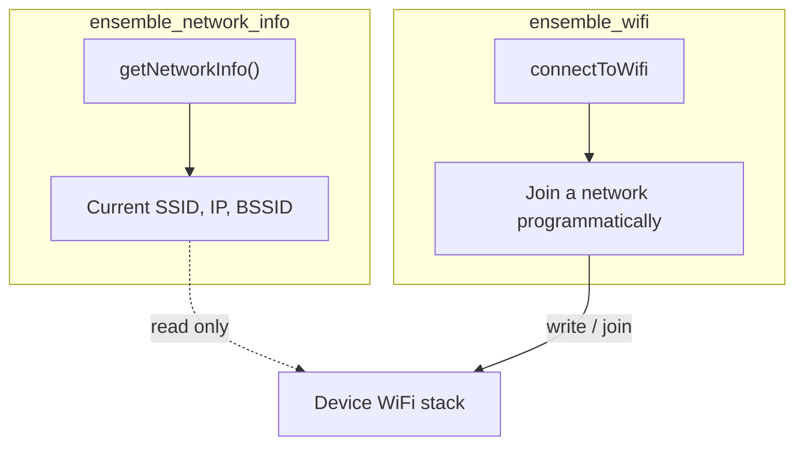
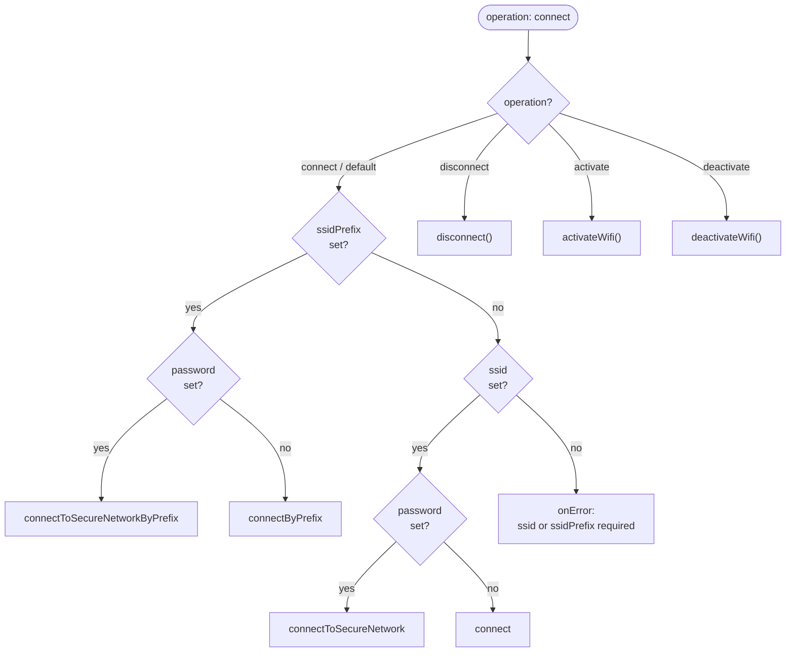
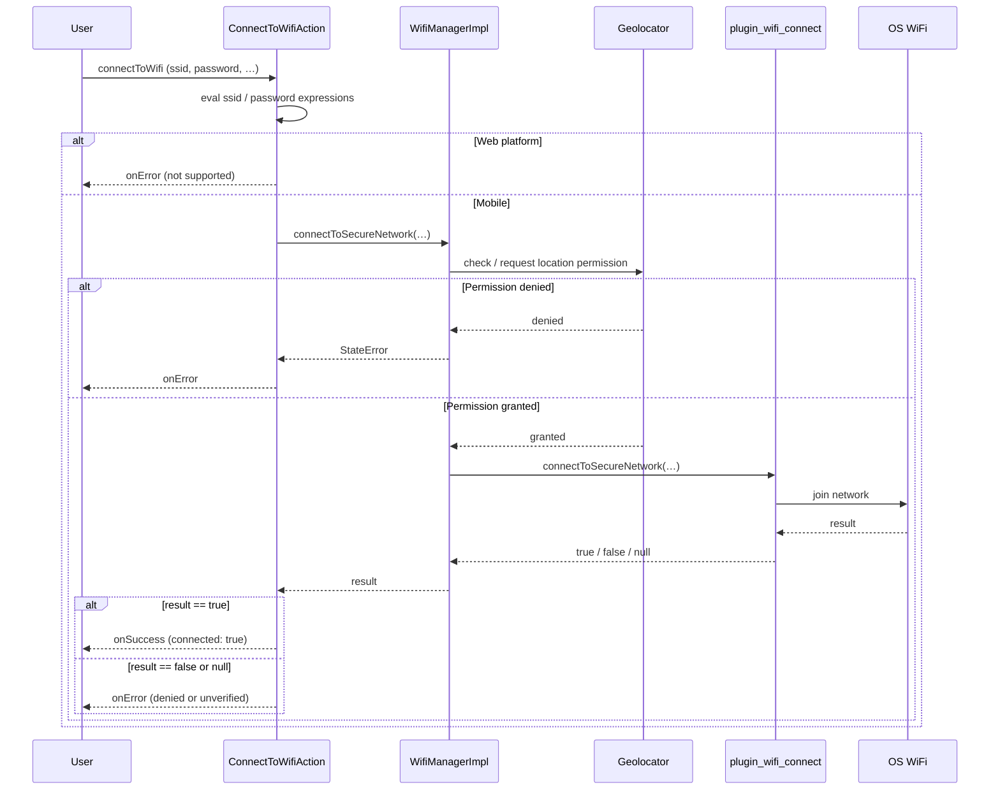
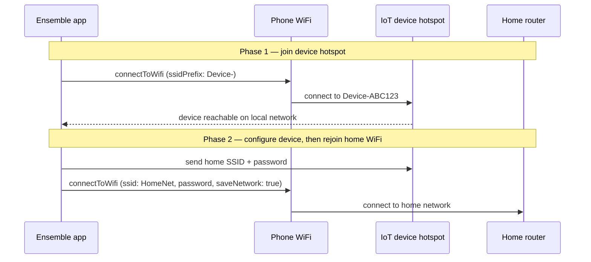

# ensemble_wifi

Ensemble module for programmatic WiFi connections on mobile devices. It wraps [`plugin_wifi_connect`](https://pub.dev/packages/plugin_wifi_connect) and exposes a single ensemble action, `connectToWifi`.

Use this module when your app needs to join a WiFi network from code — for example IoT device setup where the device broadcasts a known SSID or SSID prefix.

> **Not the same as `ensemble_network_info`** — that module *reads* WiFi metadata (SSID, IP, BSSID). This module *connects* to a network.

## Overview



When the module is disabled, the core runtime uses `WifiManagerStub`, which throws a configuration error if `connectToWifi` is invoked.

### ensemble_wifi vs ensemble_network_info



## Platform support


| Platform | Supported | Notes                                                                      |
| -------- | --------- | -------------------------------------------------------------------------- |
| Android  | Yes       | Android 10+ (API 29) recommended. Requires location permission at runtime. |
| iOS      | Yes       | iOS 11+. **Requires a physical device** — simulators cannot join WiFi.     |
| Web      | No        | Action routes to `onError` with a web-not-supported message.               |


## Enable the module

From the `starter` directory:

```bash
dart scripts/modules/enable_wifi.dart --platforms=android,ios
```

Or via the Ensemble CLI:

```bash
enable wifi
```

The enable script:

1. Uncomments the `ensemble_wifi` dependency in `starter/pubspec.yaml`
2. Sets `useWifi = true` and registers `WifiManagerImpl` in `starter/lib/generated/ensemble_modules.dart`
3. Adds Android `ACCESS_FINE_LOCATION` to `AndroidManifest.xml`
4. Adds `NSLocationWhenInUseUsageDescription` to `Info.plist`
5. Adds WiFi entitlements to `Runner.entitlements` and links them in the Xcode project

Then from the repo root:

```bash
melos bootstrap
```

Rebuild the app (full rebuild after native changes):

```bash
cd starter
flutter clean
cd ios && pod install && cd ..
flutter run
```

### iOS setup checklist

1. **Physical device** — WiFi connect does not work on the iOS Simulator.
2. **Location permission** — grant when prompted (`NSLocationWhenInUseUsageDescription`).
3. **Apple Developer portal** — enable **Hotspot Configuration** and **Access WiFi Information** for your App ID. Entitlements are written to `Runner.entitlements`, but Apple must approve Hotspot Configuration for distribution.
4. **System join prompt** — when iOS shows “Join Network”, tap **Join**. Cancelling returns a failed result.

### Android setup checklist

1. **Location permission** — grant when prompted (required on Android 10+ for WiFi connect APIs).
2. **Location services** — must be enabled on the device.

For Android 9 and below, `plugin_wifi_connect` may also require `ACCESS_WIFI_STATE`, `CHANGE_WIFI_STATE`, and `CHANGE_NETWORK_STATE` if you target older API levels.

## Ensemble action: `connectToWifi`

One action handles all WiFi operations. Set `operation` to choose the mode (default: `connect`).

### Operations


| Operation    | Description                                      | Platforms    |
| ------------ | ------------------------------------------------ | ------------ |
| `connect`    | Join a WiFi network (default)                    | Android, iOS |
| `disconnect` | Disconnect from a network joined via this plugin | Android, iOS |
| `activate`   | Turn WiFi radio on                               | Android only |
| `deactivate` | Turn WiFi radio off                              | Android only |


### Connect routing

For `operation: connect` (or when `operation` is omitted), the action picks the underlying API based on the parameters you provide:



| Parameters provided       | Behavior                                           |
| ------------------------- | -------------------------------------------------- |
| `ssidPrefix` + `password` | Secured connect to nearest network matching prefix |
| `ssidPrefix` only         | Open connect to nearest network matching prefix    |
| `ssid` + `password`       | Secured connect to exact SSID                      |
| `ssid` only               | Open connect to exact SSID                         |

### Runtime flow (connect)




### Parameters


| Parameter     | Required                                     | Default   | Description                                                   |
| ------------- | -------------------------------------------- | --------- | ------------------------------------------------------------- |
| `operation`   | No                                           | `connect` | `connect`, `disconnect`, `activate`, or `deactivate`          |
| `ssid`        | One of `ssid` or `ssidPrefix` (connect only) | —         | Exact network name                                            |
| `ssidPrefix`  | One of `ssid` or `ssidPrefix` (connect only) | —         | Match nearest network by SSID prefix (common for IoT devices) |
| `password`    | No                                           | —         | If set, uses secured connect                                  |
| `saveNetwork` | No                                           | `false`   | Remember the network on the device after connecting           |
| `isWep`       | No                                           | `false`   | WEP encryption (not supported on Android)                     |
| `isWpa3`      | No                                           | `false`   | WPA3 network                                                  |
| `isHidden`    | No                                           | `false`   | Hidden SSID (exact `ssid` connect only)                       |
| `onSuccess`   | No                                           | —         | Action run when the operation succeeds                        |
| `onError`     | No                                           | —         | Action run when the operation fails                           |


All string parameters support Ensemble expressions (e.g. `${devicePassword}`).

### Event data

**`onSuccess` (connect / disconnect)**

```yaml
data:
  connected: true   # connect/disconnect returned true
```

**`onSuccess` (activate / deactivate)**

```yaml
data:
  status: success
```

**`onError`**

```yaml
error: "<message>"
data:
  status: error
  connected: false   # or null, when connect verification failed
```

Use `${event.error}` and `${event.data.connected}` in nested actions (e.g. `showToast`).

### JavaScript

`connectToWifi` is exposed to page scripts via `ActionInvokable`:

```javascript
ensemble.connectToWifi({
  ssid: 'MyNetwork',
  password: myPassword,
  onSuccess: { showToast: { message: 'Connected' } },
  onError: { showToast: { message: event.error } }
});
```

## Examples

### Typical IoT provisioning flow



### Open network by SSID

```yaml
onTap:
  connectToWifi:
    ssid: MyIoT-Device
    onSuccess:
      showToast:
        message: Connected
    onError:
      showToast:
        message: ${event.error}
```

### Secured home network

```yaml
onTap:
  connectToWifi:
    ssid: KPN089C36
    password: ${wifiPassword}
    saveNetwork: true
    onSuccess:
      navigateScreen:
        name: Home
```

### IoT device by SSID prefix

Many IoT devices broadcast SSIDs like `DeviceName-ABC123`. Use a prefix match:

```yaml
onTap:
  connectToWifi:
    ssidPrefix: DeviceName-
    password: ${devicePassword}
    onSuccess:
      showToast:
        message: Connected to device
```

### Disconnect

```yaml
onTap:
  connectToWifi:
    operation: disconnect
    onSuccess:
      showToast:
        message: Disconnected
```

## Troubleshooting


| Symptom                                            | Likely cause                                                                                               |
| -------------------------------------------------- | ---------------------------------------------------------------------------------------------------------- |
| Config error: module not enabled                   | Run `enable_wifi.dart` and `melos bootstrap`                                                               |
| Web not supported                                  | Expected — use Android or iOS device                                                                       |
| iOS `hotspotError_8` / internal error on Simulator | Expected — test on a physical iPhone                                                                       |
| Connect fails after location granted               | Wrong SSID/password, join prompt cancelled, or Hotspot Configuration not enabled in Apple Developer portal |
| Prefix connect fails on older Android              | May need legacy WiFi permissions in `AndroidManifest.xml` (API 28 and below)                               |


## Development

```bash
melos bootstrap
melos exec --scope="ensemble_wifi" -- flutter analyze
```

## Related


| Package / module        | Purpose                                                        |
| ----------------------- | -------------------------------------------------------------- |
| `ensemble` (core)       | `ConnectToWifiAction`, `WifiManager` stub, action registration |
| `ensemble_network_info` | Read current WiFi name, IP, BSSID (does not connect)           |
| `plugin_wifi_connect`   | Native WiFi connect plugin                                     |


