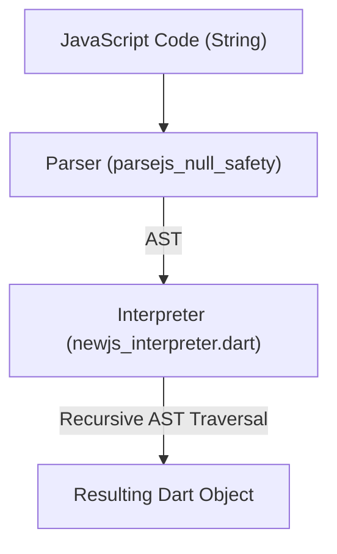
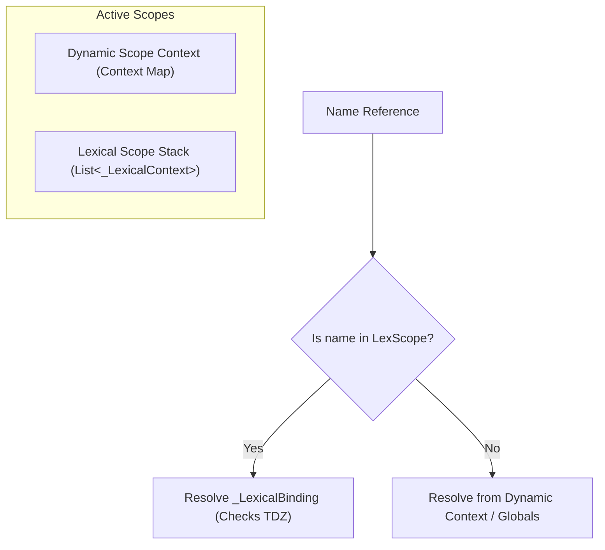
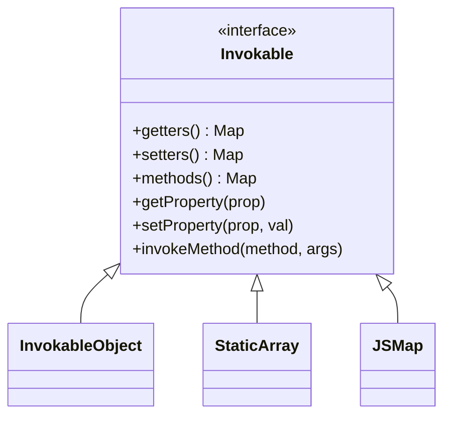

# Interpreter Architecture & Execution Model

`ensemble_ts_interpreter` is a pure Dart interpreter that executes JavaScript source code inside Flutter applications. It interprets the Abstract Syntax Tree (AST) nodes generated by `parsejs_null_safety` to run calculations, conditional logic, API callback handling, and dynamic UI state binding.

---

## 1. Execution Flow & Compilation Pipeline

The interpreter executes code through a clean pipeline:

---

## 2. AST Visitor Evaluation Loop (`newjs_interpreter.dart`)

The core execution engine is defined by `JSInterpreter`, which extends `RecursiveVisitor<dynamic>`.
* **Visitor Evaluation**: It evaluates expressions and statements by overriding AST visitor hooks. For example:
  * `visitIf(IfStatement)` evaluates the condition, casts it to a boolean, and conditionally executes the `then` or `otherwise` block.
  * `visitBinary(BinaryExpression)` evaluates the left and right operands, then executes the corresponding Dart operator (e.g. arithmetic, logical, or comparison).
* **Control Flow Hijacking**: To support statements like `return`, `break`, and `continue`, the interpreter throws control-flow exceptions (`ControlFlowReturnException`, `ControlFlowBreakException`, `ControlFlowContinueException`) which are caught by parent block/loop visitors to redirect execution.

---

## 3. Scope & Scope Lifecycles

Variable resolution operates on two independent scope context models:

### A. Dynamic Scope (`Context`)
Variables declared via `var` and function declarations are hoisted to the enclosing function or global context. Context variables are stored in simple key-value maps. The interpreter resolves these dynamically during runtime property lookup.

### B. Lexical Scope (`_LexicalContext`)
Block-level variables (`let` and `const`) are managed on a stack of `_LexicalContext` structures:
* **Scope Entry**: Every `visitBlock` pushes a new `_LexicalContext`.
* **Temporal Dead Zone (TDZ)**: Lexical variables are hoisted as uninitialized bindings. Accessing an uninitialized binding throws a `JSException`.
* **Const Protection**: Const bindings cannot be reassigned; doing so throws a runtime exception.
* **Per-Iteration Scopes**: Loops push a new `_LexicalContext` for every iteration. This ensures closures created inside loops capture a snapshot of the iteration's state rather than sharing a single reference.

---

## 4. The Invokable Framework

To bridge Dart/Flutter widgets with JavaScript scripts, the interpreter uses the `Invokable` framework.

### Invokable Interface
Any Dart class that mixes in `Invokable` can be passed directly to the interpreter. The interpreter calls:
* `getters()`: To list properties readable by JS.
* `setters()`: To list properties writable by JS.
* `methods()`: To list functions executable by JS.
This makes native Flutter UI controllers, fields, and action behaviors immediately scriptable in JavaScript.

---

## 5. Type Marshaling & Interoperability

The interpreter marshals data between JavaScript and Dart boundaries:

| JavaScript Concept | Dart Type / Object | Boundary Conversion |
| :--- | :--- | :--- |
| **`null`** | `null` | Directly mapped to Dart `null` |
| **`undefined`** | `jsUndefined` (`JSUndefined`) | Out-of-bounds list index reads or empty returns result in `jsUndefined`. |
| **Numbers / Strings** | `num` / `String` | Maps to standard Dart primitives |
| **Array** | `List<dynamic>` | JS arrays are standard Dart lists |
| **Object** | `Map<dynamic, dynamic>` / `Invokable` | Standard JS objects are represented as Dart Maps or `Invokable` objects. |
| **Symbols** | `JSSymbol` | Encapsulates ES6 Symbol keys for maps |

---

## 6. Asynchronous Chaining & Promises

Asynchronous execution uses Dart's native `Future` systems without blocking UI thread rendering.

* **Analysis**: `_containsAwait` checks if a statement/expression contains `await`. If not, it executes synchronously with zero overhead.
* **Execution**: If `await` is present, it runs in `_executeAsyncStatement`, yielding control back to Dart's event loop via async/await futures.
* **Polyfills**:
  * `Promise`: Modeled by `JSPromise` wrapping a Dart `Completer`.
  * Promise methods (`all`, `allSettled`, `race`, `any`, `finally`) are mapped directly to Dart `Future` helpers like `Future.wait` and `Future.any`.
  * `toFuture()`: Facilitates converting `JSPromise` instances to Dart `Future` objects at the Dart-to-JS integration boundary.
