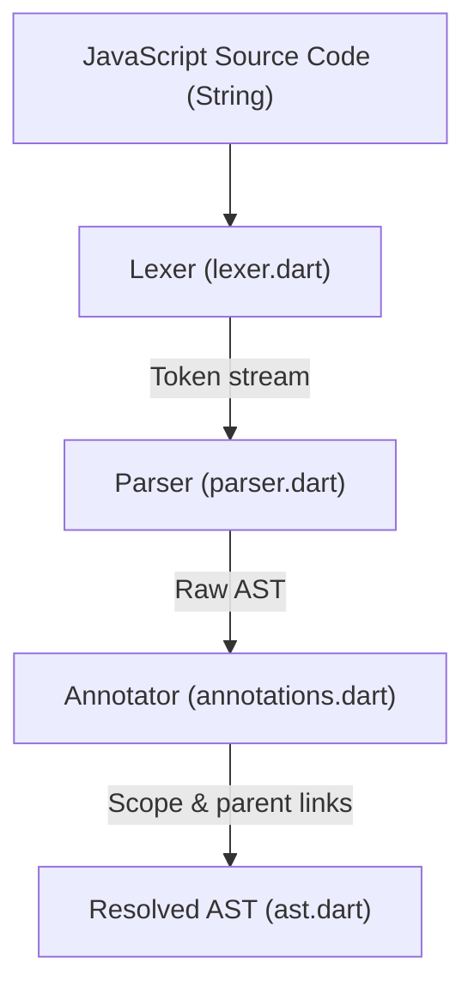
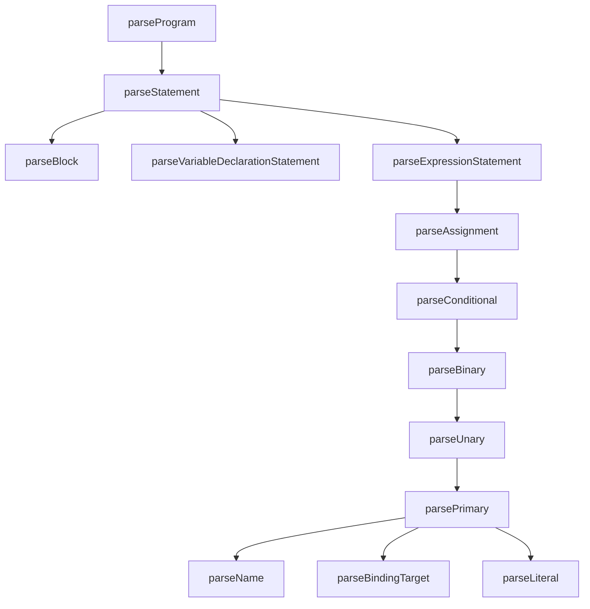
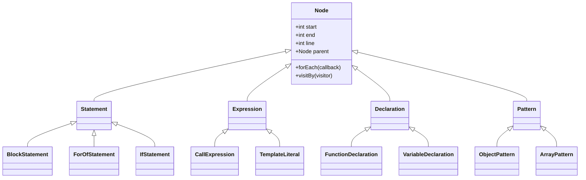

# JavaScript Parser Architecture & Design

`parsejs_null_safety` is a complete JavaScript parser written in Dart. It parses JavaScript source code (supporting ES5 syntax plus selected ES6 features) and builds a strongly typed Abstract Syntax Tree (AST) conforming to the ESTree specification.

---

## 1. High-Level Architecture

The parser translates raw source text into a structured, resolved AST through three distinct stages:

1. **Lexical Analysis (`lexer.dart`)**: Scans code units character-by-character, discarding whitespace and comments, and emitting a stream of `Token` instances.
2. **Syntactic Analysis (`parser.dart`)**: A recursive descent parser that consumes tokens, applies grammar rules, and constructs `Node` instances representing language constructs.
3. **AST Annotation (`annotations.dart`)**: Performs a post-parse traversal over the raw AST to build scope environments, link variable references to their scopes, and wire `parent` pointers.

---

## 2. Lexical Scanning & Tokenization (`lexer.dart`)

The Lexer tokenizes the source text efficiently without regex, scanning character codes directly.

### A. Core Token Classification
Each `Token` has a `type` (corresponding to character codes or token constants) and metadata (like precedence, line number, and character offsets).
* **Keywords & Identifiers**: Decoded via `scanIdentifier`. Keywords (`function`, `var`, `let`, `const`, `if`, `for`, `async`, `await`, etc.) are resolved from a static lookup table.
* **Numeric Literals**: Parsed by `scanNumber` supporting decimal, hexadecimal (prefixed with `0x`), octal, and scientific notation exponents.
* **Regular Expressions**: When the parser expects an expression, it instructs the lexer to scan a RegExp literal using `scanRegexpBody` (handling escaped forward slashes and flags).
* **Template Literals**: `scanTemplateLiteral` parses backtick-wrapped text, tracking brace depth `{}` to capture nested interpolations correctly.

### B. Comment & Noise Handling
* **Standard Comments**: Single-line (`//`) and multi-line (`/* */`) comments are skipped.
* **HTML comments / Hashbangs**: Tolerates noise at the start of scripts (such as `#!` shell flags or HTML comment tags like `<!--` and `-->`) if `handleNoise` is enabled.

---

## 3. Syntactic Parsing (`parser.dart`)

The parser is structured as a recursive descent engine. It is organized into hierarchical parsing layers, from statements down to expressions:

### A. Statement Grammar (`parseStatement`)
Processes block statements, variables, loops (`for`, `for...in`, `for...of`), conditional branch paths (`if`/`else`), exception blocks (`try`/`catch`/`finally`), switches, labels, returns, throws, and function declarations.

### B. Expressions Grammar (`parseExpression`)
Uses operator precedence parsing to build expression nodes:
* **Optional Chaining (`?.`)**: Handles optional properties, optional bracket access, and optional function calls. If an optional chain is encountered, it sets the `optional` flag to `true` on the resulting AST node.
* **Nullish Coalescing (`??`)**: Parsed at the logical operator level with logical OR precedence (`Precedence.NULLISH_COALESCING`).
* **Spread and Destructuring**:
  * `parseBindingTarget()` parses destructuring patterns (both `ObjectPattern` and `ArrayPattern`) during declarations.
  * `parseParameter()` parses default values (`DefaultParameter`) and rest parameters (`RestParameter`).
  * `parsePrimary()` parses spread nodes (`SpreadExpression`) in array literals and calls.

---

## 4. AST Structure & Node Hierarchy (`ast.dart`)

Every syntax construct in JavaScript maps to a class inheriting from the abstract class `Node`.

* **Position Tracking**: Nodes store source code offsets (`start`, `end`) and the line number (`line`) for accurate runtime stack traces and debug diagnostics.
* **Property Nodes**: Represents object properties, handling shorthand properties (`{ x }`), computed keys (`{ [key]: value }`), and getter/setter accessors.

---

## 5. Visitor Pattern (`ast_visitor.dart`)

To inspect or transform the AST without casting, `parsejs_null_safety` uses the Visitor Pattern:

### A. Visitor Interfaces
* `Visitor<T>`: A visitor that takes a single AST node and returns `T`.
* `Visitor1<T, A>`: A visitor that takes an AST node and an additional argument of type `A`, returning `T`.

### B. Visitor Implementations
* `BaseVisitor<T>` / `BaseVisitor1<T, A>`: Basic implementations that route all nodes through a central `defaultNode(node)` fallback method. Implementing a custom compiler or analyzer only requires overriding the nodes of interest.
* `RecursiveVisitor<T>`: Automatically traverses child nodes recursively.

---

## 6. Scope Resolution & Semantic Binding (`annotations.dart`)

Calling `annotateAST(Program)` resolves names and scopes before evaluation:

1. **Parent Linking**: Builds the tree's upward links by setting `Node.parent` on all child nodes.
2. **Environment Extraction (`EnvironmentBuilder`)**: Traverses the AST to build local scopes (`Scope`). It maps binding declarations (`var`, `let`, `const`, function parameters, catch exception variables) to their corresponding lexical scopes:
   * `let` and `const` bindings are bound to the enclosing block scope.
   * `var` and `function` declarations are hoisted and bound to the enclosing function or program scope.
3. **Reference Resolving (`Resolver`)**: Links every variable reference (`Name`) to the `Scope` that defines it, resolving closures and outer scopes statically.
